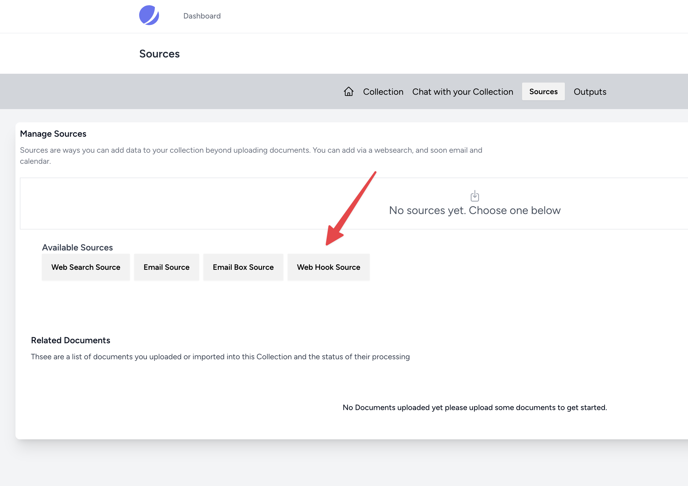
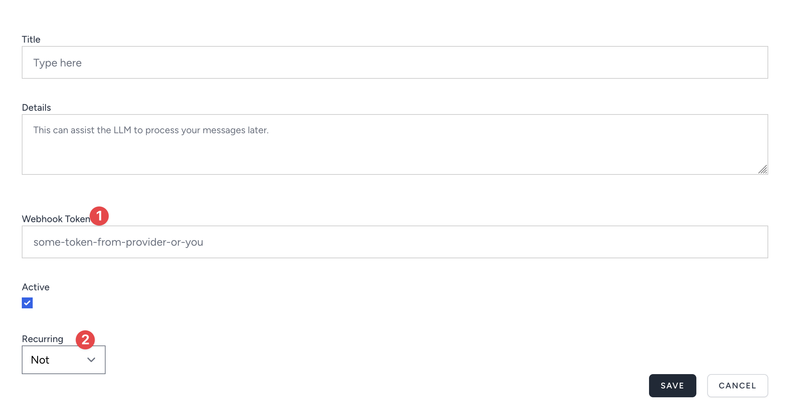
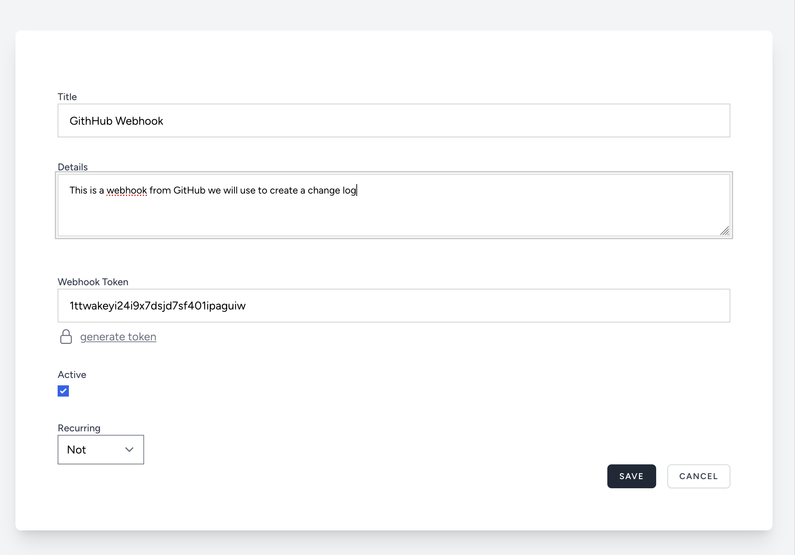
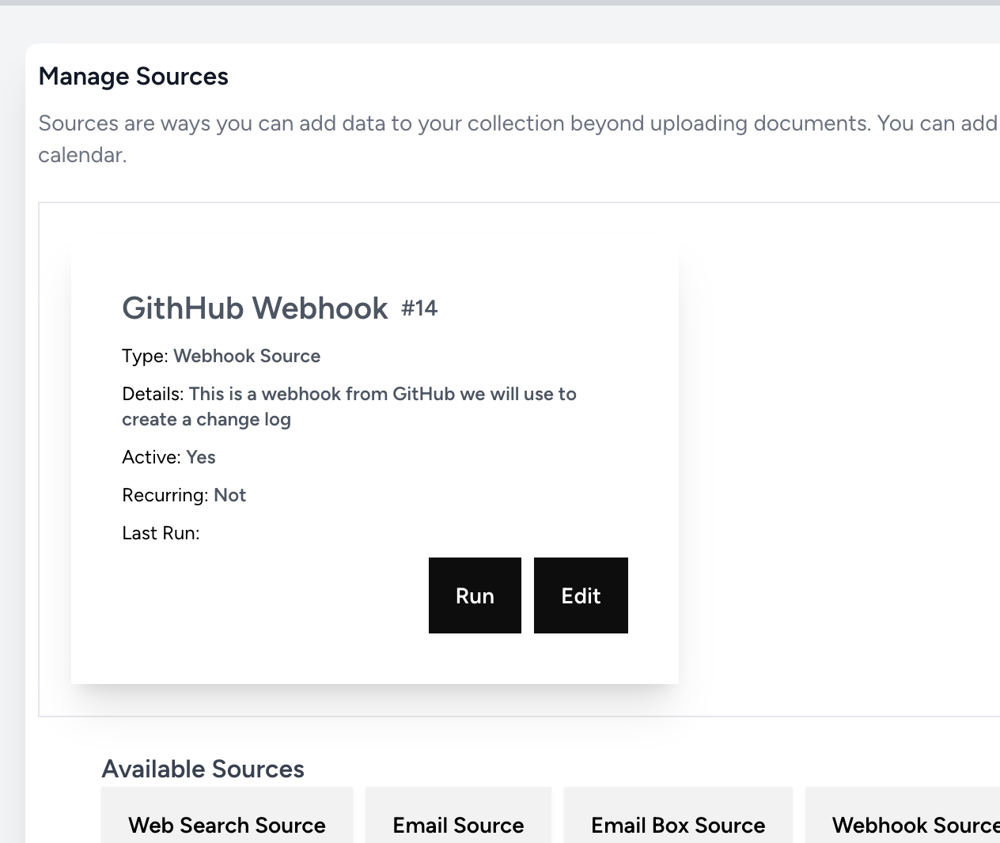
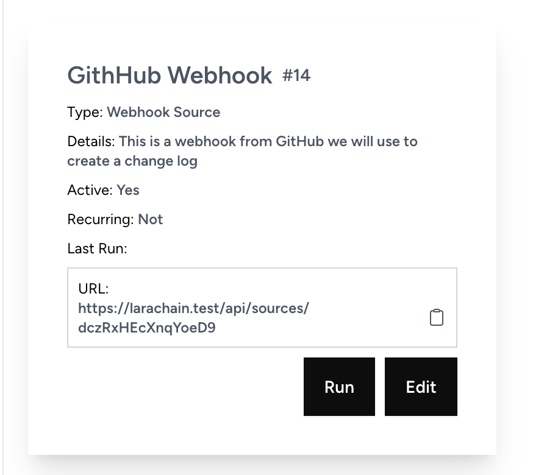
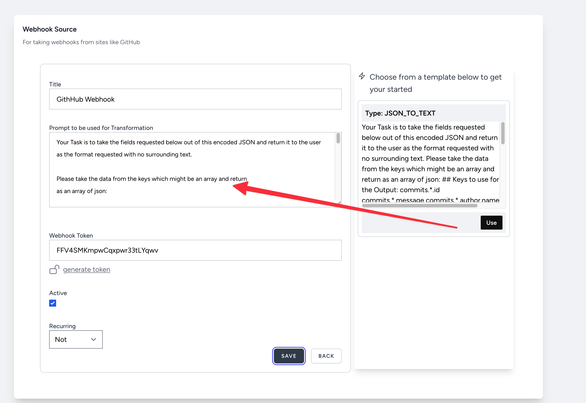
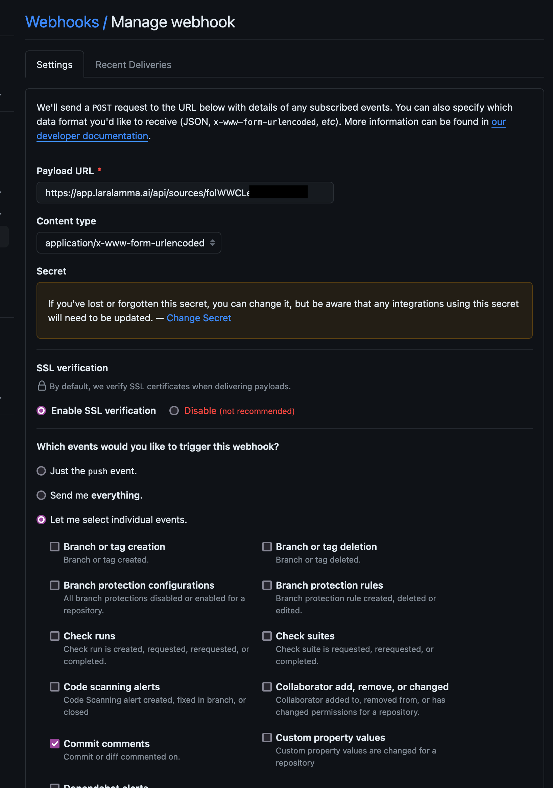
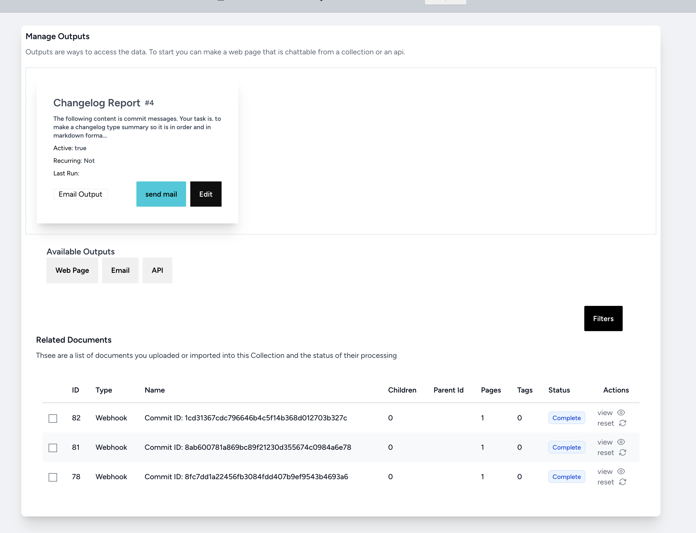
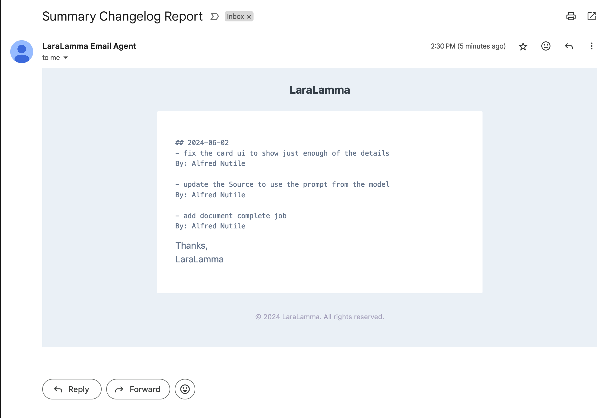

# Developing
How to modify the system and add your own Sources, Outputs, and Transformers.


## Theme Layer

Tailwind is at the cord but to simplify code I am using https://daisyui.com/ to drive the ui (80% transitioned to it)


## Sources 


>NOTE: All the others can be created but only Sources has a generator at the moment.

There are generators that come with the system. We will make a source that allows GitHub webhooks to come into the
system. If we do it right it might even allow any type of webhook.

> NOTE: all code can be seen here https://github.com/LlmLaraHub/laralamma/tree/adding_a_source


### Generator

```bash
php artisan laralamma:source:create
```

Then it will ask you some questions.

  * What is the name of the source?
  * What is the description of the source?

One, will be PascalCase and end in Source for example:
>WebhookSource

Two, some information about the source since this will show in the UI later.

Example:
>"Create a secure api for Webhooks, like GitHub, to send data to LaraLamma"

Once done you will have a lot of new files:

```bash
app/Domains/Sources/WebHookSource.php
app/Http/Controllers/Sources/WebHookSourceController.php
resources/js/Pages/Sources/WebHookSource/Components/Card.vue
resources/js/Pages/Sources/WebHookSource/Create.vue
resources/js/Pages/Sources/WebHookSource/Edit.vue
resources/js/Pages/Sources/WebHookSource/Resources.vue
tests/Feature/Http/Controllers/WebHookSourceControllerTest.php
tests/Feature/WebHookSourceTest.php
```

### Controller
Let's start with the controller. If you visit the site now you will see your new source.



Now you can even click Create and add it and then save. You can also click the run button and see a message in the logs.
But it does not do much 🙂

Since it is almost like the `app/Http/Controllers/AssistantEmailBoxSourceController.php` let's go steal some code from there.

> Note: we should leave the show and create path alone we can update the info though.

```php 
    protected function makeSource(array $validated, Collection $collection): void
    {
        Source::create([
                'title' => $validated['title'],
                'details' => $validated['details'],
                'recurring' => $validated['recurring'],
                'active' => $validated['active'],
                'collection_id' => $collection->id,
                'slug' => str(Str::random(16))->toString(),
                'type' => $this->sourceTypeEnum,
                'meta_data' => [],
                'secrets' => [
                    'token' => Str::random(24),
                ]
            ]
        );
    }
```

We want to add a token during the "makeSource" so we can show the user that in the ui later for them to use the webhook.
Then we need to update the `resources/js/Pages/Sources/WebHookSource/Create.vue` to add this field to the form.
The token is sometimes given to us by the webhook and sometimes we have to generate it.


### Create Form Vue

```js 
const form = useForm({
    title: '',
    details: '',
    recurring: 'not',
    meta_data: {},
    secrets: {
        token: "",
    },
    active: true
});

```

> Note: There are so many examples in the other Vue Components that we can use.

And then the form itself `resources/js/Pages/Sources/WebHookSource/Components/Resources.vue`:


```js 
    <div>
        <InputLabel value="Webhook Token"/>
        <input v-model="modelValue.secrets.token" type="text" placeholder="some-token-from-provider-or-you"
               class="rounded-none input input-bordered w-full " />
        <InputError :message="modelValue.errors?.secrets?.token" />
    </div>
```

Now in the UI we can see this:



Let's add the token generator from the `resources/js/Pages/Outputs/ApiOutput/Components/Resources.vue` to the form.

```js 
    <div>
     <InputLabel value="Webhook Token"/>
      <input v-model="modelValue.secrets.token" type="text" placeholder="some-token-from-provider-or-you"
           class="rounded-none input input-bordered w-full " />
      <InputError :message="modelValue.errors?.secrets?.token" />
      <!-- this is the new line -->
      <GenerateToken :size="32" @generatedToken="generatedToken"/> 
    </div>
```
and in the `script` add this:

```js
import GenerateToken from "@/Components/GenerateToken.vue";


const generatedToken = (token) => {
    console.log('generatedToken', token);
    props.modelValue.secrets.token = token;
}
```

It will end up looking like below:



And once we save it:



We see in the database the token is saved in the secrets which we have to let the user see for later on or end.
Lastly we need to make the url for this so the webhook can actually hit the system. 

Before we do that let's fix the our Card and Edit form.

`resources/js/Pages/Sources/Index.vue`


### Now for the Card

Just add your new card to the imports:


`import WebhookSource from "@/Pages/Sources/WebhookSource/Components/Card.vue";`

Then add it below:

```js 
<template v-else  v-for="source in sources.data" :key="source.id">
    <EmailCard v-if="source.type_key === 'email_source'" :source="source"></EmailCard>
    <EmailBoxCard v-else-if="source.type_key === 'email_box_source'" :source="source"></EmailBoxCard>
    <!-- this is the new line -->
    <WebhookSource v-else-if="source.type_key === 'webhook_source'" :source="source"></WebhookSource>
    <Card v-else :source="source"></Card>
</template>
```

And the Edit card should be all set `resources/js/Pages/Sources/WebhookSource/Edit.vue`

```js 
const form = useForm({
    title: props.source.data.title,
    details: props.source.data.details,
    active: props.source.data.active,
    recurring: props.source.data.recurring,
    secrets: {
        token: props.source.data.secrets.token,
    },
});
```
### Now for the main Class

Now we need to do something with this. The other file made is `app/Domains/Sources/WebhookSource.php`
And if you click "Run" on the car it will show in the Logs "[2024-06-02 00:30:53] local.INFO: [LaraChain] - WebhookSource Doing something"

We need to take in the webhooks so let's add a route and method to the controller we made: 

```php 
    //app/Http/Controllers/Sources/WebhookSourceController.php:45
    public function api(Source $source)
    {
        try {
            Log::info('[LaraChain] - WebhookSourceController', [
                'source' => $source->id,
            ]);

            $webhookSource = (new WebhookSource())->payload(request()->all());

            WebhookSourceJob::dispatch(
                $webhookSource,
                $source
            );

            return response()->json(['message' => 'ok']);
        } catch (\Exception $e) {
            Log::error('Error running WebhookSource', [
                'error' => $e->getMessage(),
            ]);

            return response()->json(['message' => $e->getMessage()], 400);
        }
    }
```


### The Route 

Then we need to add a route to the `routes/api.php` file:

```php 
Route::controller(\App\Http\Controllers\Sources\WebhookSourceController::class)->group(
    function () {
        Route::post('/sources/{source:slug}', 'api')
            ->name('collections.sources.webhook_source.api');
    }
);
```

and we can add a test for it 

> Note: we will come back with the token shortly.

Let's see what a payload looks like coming back from the webhook I added the fixture here:

`tests/fixtures/example_github.json`

Then in the test we can see it all working:

`tests/Feature/Http/Controllers/WebhookSourceControllerTest.php:71`


Finally, I will do some quick work in the Class `app/Domains/Sources/WebhookSource.php:43` knowing I do not want to hold up the request.

> NOTE: GitHub Webhooks require a short return time, so it is in a job

Ok so when the webhook comes in we make a document of the payload but let's now take what matters. We are going to use 
Edit to make the "summary" be the prompt.

To our controller we are going to override the `getPrompts` method:

```php 
    //app/Http/Controllers/Sources/WebhookSourceController.php:69
    public function getPrompts()
    {
        return [
            'email' => GithubTransformer::prompt('[CONTEXT]'),
        ];
    }
```

And we made a Transformer. Keep in mind the user can make their own prompts as you will see in the UI. But we want to 
put some templates and starters in place.

`app/Domains/Prompts/Transformers/GithubTransformer.php`

Let's also update the card to show the url we will use in this. 



```js 
    <div class="text-xs border-gray-300 p-2 border">
        URL: <span class="font-bold text-gray-600">
            <Clipboard :content="source_url">{{ source_url}}</Clipboard>
        </span>
    </div>
```


So now the user can choose a prompt to help them out but you can write any prompt you want. This is the power of NO CODE systems like LaraLamma. 
It gives the user the ability to make their own prompts and then use them in the system.





So we have most of it setup. The Route, Controller, the UI, so now to add our settings to GitHub.

You are ready to receive webhooks from GitHub as seen below:



And then the data will come in as seen here:




### Create the Output

Lastly we added the Outputs of type Email to send the email with the prompt being built in the UI as well.

```text 
The following content is commit messages. Your task is. to make a changelog type summary so it is in order and in markdown format as follows

## [date]
[message]
By: [author]


The return output will be markdown
```

And that is it we will get an email when we click send or if we set it up to do it on certain days. 

But ideally we can tie this into another system more on that later.



