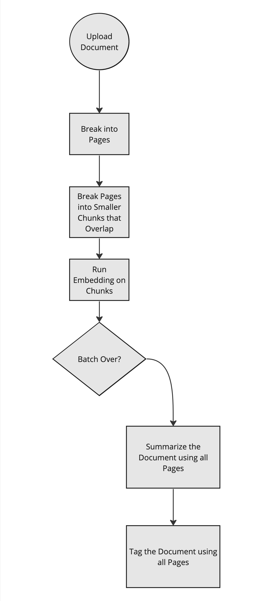
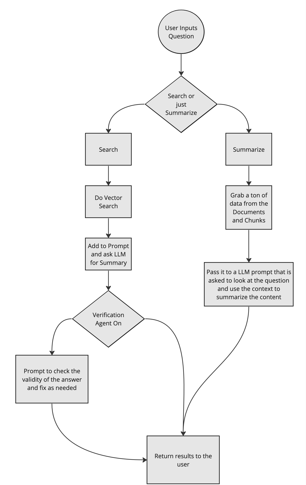
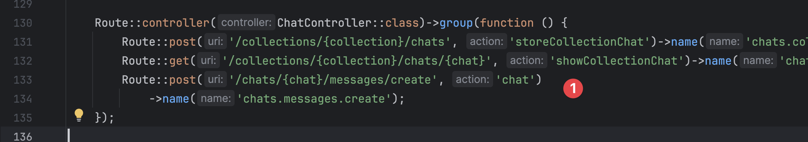

Digging Into the Code
=====

Let's start from the request of uploading a document. After that we will cover the chat part of it.

Uploading Documents
----------------




Like most systems it is good to follow the code from the ``web.php`` path in. (Outside In)

``app/Http/Controllers/CollectionController.php:85``

This is the method that starts the upload process.

Depending on the type it will use a different processor. But in the end it all ends up about the same as Text!

```app/Jobs/ProcessFileJob.php:61``

You can see here the batch jobs are kicked off. Horizon and Batching is key to all of this.


```php 
Log::info('Processing PDF Document');
    Bus::batch([
        new ParsePdfFileJob($this->document),
    ])
        ->name('Process PDF Document - '.$document->id)
        ->finally(function (Batch $batch) {
            //this is triggered in the PdfTransformer class
        })
        ->allowFailures()
        ->onQueue(LlmDriverFacade::driver($document->getDriver())->onQueue())
        ->dispatch();
```

    

Then you will see it break the page into smaller chunks:


```php 
foreach ($pages as $page_number => $page) {
        try {
            $page_number = $page_number + 1;
            $pageContent = $page->getText();

            $size = config('llmdriver.chunking.default_size');
            $chunked_chunks = TextChunker::handle($pageContent, $size);
            foreach ($chunked_chunks as $chunkSection => $chunkContent) {
                $guid = md5($chunkContent);
                $DocumentChunk = DocumentChunk::updateOrCreate(
                    [
                        'document_id' => $this->document->id,
                        'sort_order' => $page_number,
                        'section_number' => $chunkSection,
                    ],
                    [
                        'guid' => $guid,
                        'content' => to_utf8($chunkContent),
                    ]
                );

                $chunks[] = [
                    new VectorlizeDataJob($DocumentChunk),
                ];

            }
```

    

Now the content is in the system and the vectorization will hit the embedding api to turn that into vector data.

Chatting
----------------




Alright so now that the data is in the system what happens when the user clicks the Chat button.

    

From there we go into the controller.

This is the one tricky area since there are two starting types of user interactions to start.
The user might be asking to Search for something and summarize it OR they might just want a summary of the content.

Since Ollama does not have functions I fake it with a first LLM request:

``\LlmLaraHub\LlmDriver\NonFunctionSearchOrSummarize``

```php
$prompt = SearchOrSummarize::prompt($input);

$response = LlmDriverFacade::driver(
    $collection->getDriver()
)->completion($prompt);
```

So here the prompt does this:

```php
public static function prompt(string $originalPrompt): string
            {

                Log::info('[LaraChain] - SearchOrSummarize Prompt');

                return <<<PROMPT
        ### Task, Action, Goal (T.A.G)
        **Task**: Determine the appropriate response mode based on the user's question, choosing between 'search_and_summarize' and 'summarize'.
        **Action**: Analyze the user's question to assess whether it requires pulling in additional information for a comprehensive response ('search_and_summarize') or merely summarizing the information provided or referenced ('summarize').
        **Goal**: Return the correct keyword that instructs further actions — either 'search_and_summarize' if the query demands a search combined with summarization, or 'summarize' if the query only needs a summarization of known or given content.

        ### Example Prompt Execution
        **User Question**: "What is four key metrics?"
        **LLM Response**: "search_and_summarize"

        **User Question**: "What is this document about?"
        **LLM Response**: "summarize"

        ### Actual Question
        **User Question**: $originalPrompt
        **LLM Response**: [return just this]

        PROMPT;
            }
        }
```

        

This tries to use the LLM to simply tell LaraLamma what it should do.


Finally we need to find the data if it is a search and here is the key to that:

``\LlmLaraHub\LlmDriver\DistanceQuery``


```php 
$documentIds = Document::query()
            ->select('id')
            ->when($filter, function ($query, $filter) {
                $query->whereIn('id', $filter->documents()->pluck('id'));
            })
            ->where('documents.collection_id', $collectionId)
            ->orderBy('id')
            ->pluck('id');

        $commonQuery = DocumentChunk::query()
            ->orderBy('sort_order')
            ->orderBy('section_number')
            ->whereIn('document_id', $documentIds);

        $neighborsCosine = $commonQuery
            ->nearestNeighbors($embeddingSize, $embedding, Distance::Cosine)
            ->get();
```
        


So we just use that great library for finding the items that should be close to the question.
Then after that the code will grab any sibling chunks.

This "context" is then passed to the prompt later on.

``Modules/LlmDriver/app/NonFunctionSearchOrSummarize.php:78``


```php
$contentFlattened = SummarizePrompt::prompt(
            originalPrompt: $input,
            context: $context
        );

        Log::info('[LaraChain] - Prompt with Context', [
            'prompt' => $contentFlattened,
        ]);

        $response = LlmDriverFacade::driver(
            $collection->getDriver()
        )->completion($contentFlattened);

```


So at this point it is just giving it the right prompt, the right context and that then return the results.

:::info
There will be data verification agents, they are off right now using Pennant but later will be on.
:::

That is it!
