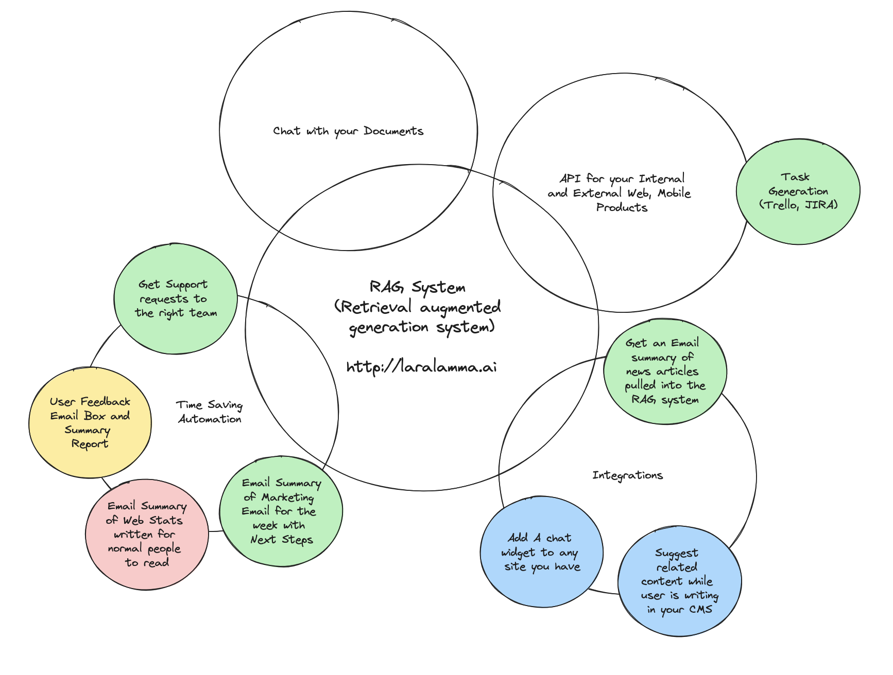
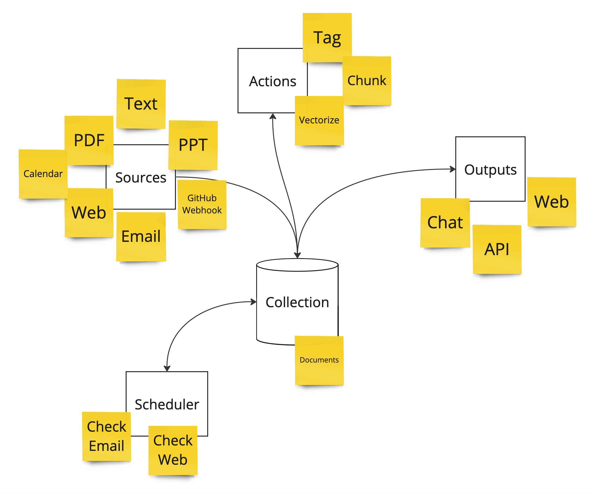

# LaraLamma

LaraLamma is based on Laravel and is a great foundation for any LLM centric application
especially a RAG system.

The code is here [https://github.com/LlmLaraHub/laralamma](https://github.com/LlmLaraHub/laralamma)

::: info
A RAG system (Retrieval augmented generation system (RAG - an architectural approach that can improve the efficacy of large language model (LLM) applications
:::

It really can be more than a search mechanism for your business.

  * Want to surface the most common customer feedback requests just send them to your Collection.
  * Want to centralize emails and route them to the correct support team just have a Source check that email box.
  * Want to Chat with your data on another site, just point the included chat widget to the Output on that collection.
  * Have a shared marketing inbox, have all those messages summarized and sent to the right people

::: info
LLMs are large language models
:::

## Three Key Concepts 

## Source

This is how you get data into the system. There are many ways to do this. 

  * Upload files (PDF, PPT, Text etc)
  * Send in data as emails (the system can query an email box or you can forward to it)
  * Send in data via a webhooks (Create for GitHub data)

### Trasnformers 

The system will already vectorize (make sure data easier for the Language Models to search) and tag but you can add more Prompt based trasnformers to alter your data. A great example can be seen here [https://youtu.be/KM7AyRHx0jQ?si=vnYG0PE8I8OCVEQa](https://youtu.be/KM7AyRHx0jQ?si=vnYG0PE8I8OCVEQa) as the user can write a "Prompt" to take complex JSON data from GitHub and turn it into a simple summary.

::: tip
Prompting enpowers the user to write plain language instructions for the computer to do.
:::

### Output

After you have all your data in the system there are so many ways you can get to it and use it.
  * Log into the system and Chat with your collection
  * Have it send you daily, weekly summary emails
  * Post to a website the updates
  * React to a customer support ticket by replying to a message based on all of it's data on the related domain

## About Your Data

Below is what the system does with the data you add to it to make it more LLM friendly.

### Collections

Collections make up the “Chattable” grouping of Documents. You make a collection and add documents to it.

Since this system uses Laravel JetStream [https://jetstream.laravel.com/introduction.html](https://jetstream.laravel.com/introduction.html) we can share those collections with others on the team.

### Documents

This is the foundation to the searchable content. It can come from PDFs, Websites, Power Points, Text and more.

When a document is added the system will do the following.

  * Break it into Chunks (small fragments) that overlap with the sibling before and after it.
  * Do vector embedding on it so we can query it later

### Document Chunks

These are related to documents. They have the chunk of text from the document. A page number and a sort number. This always has the vector field we do all the searching on.

