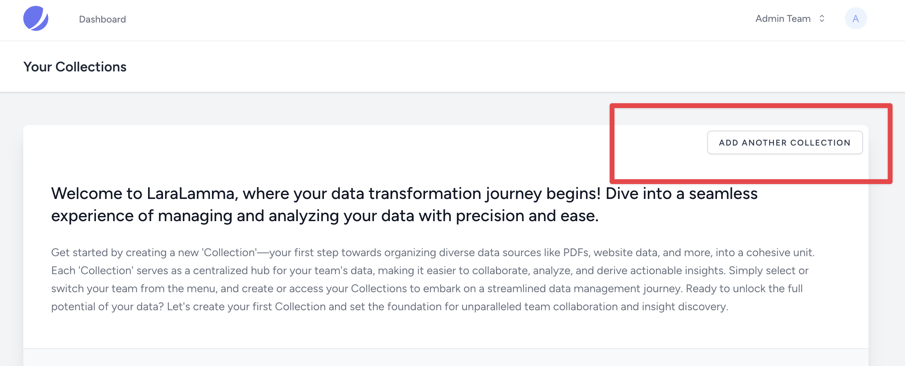
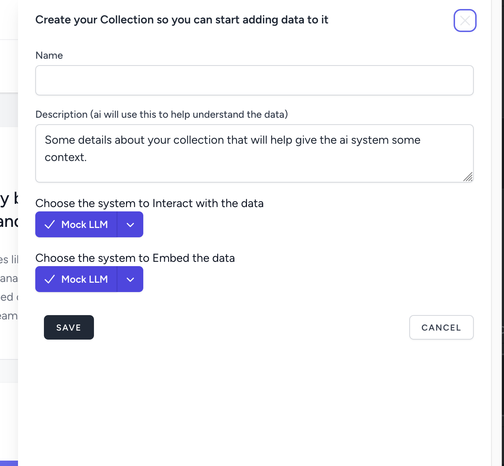
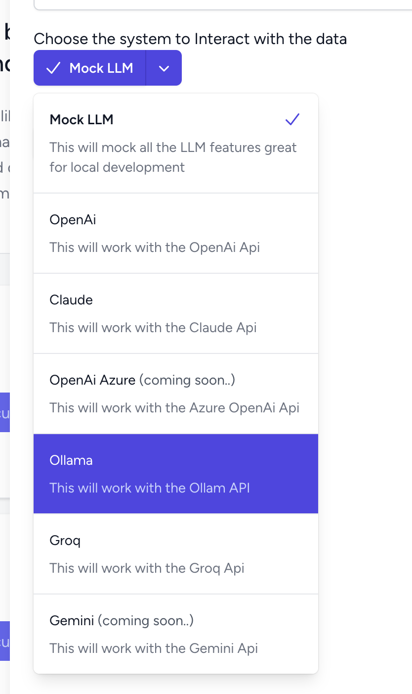
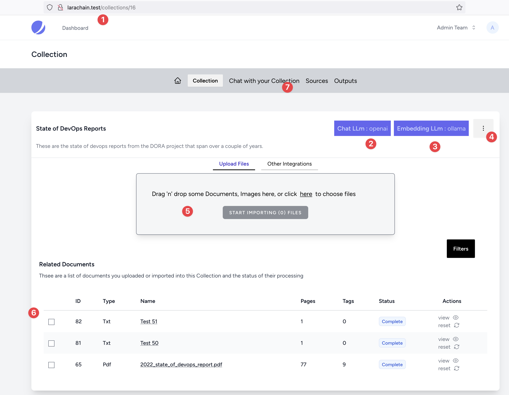
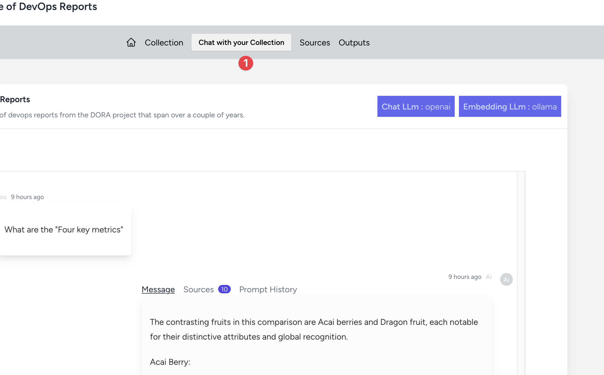
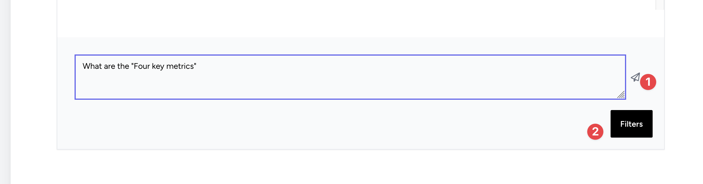
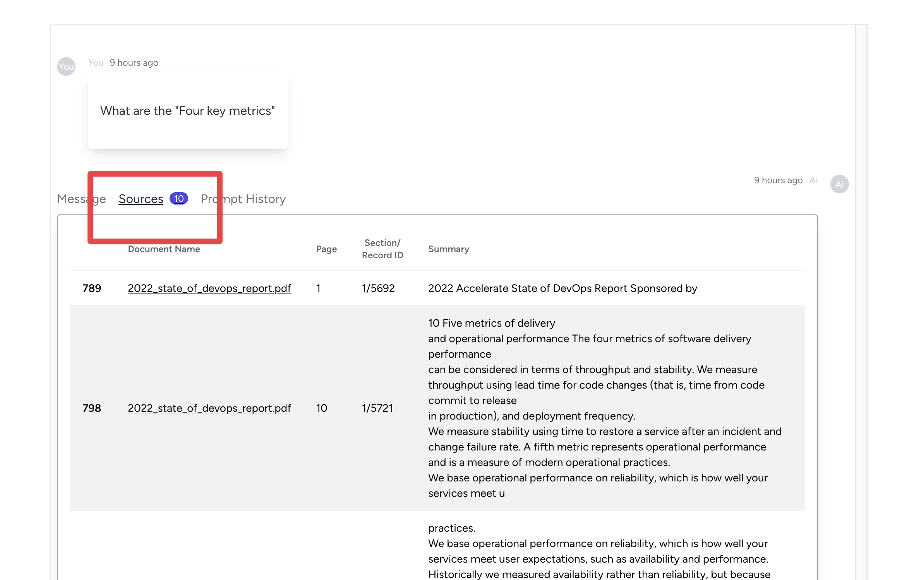
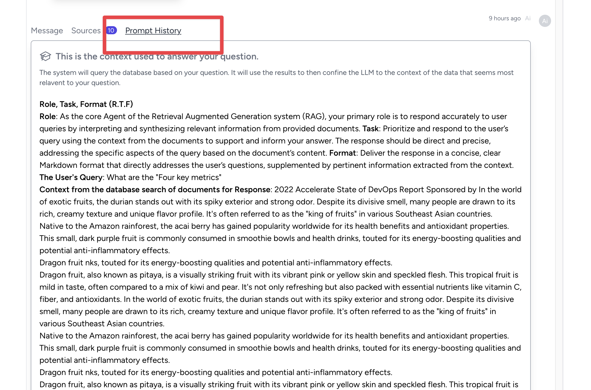
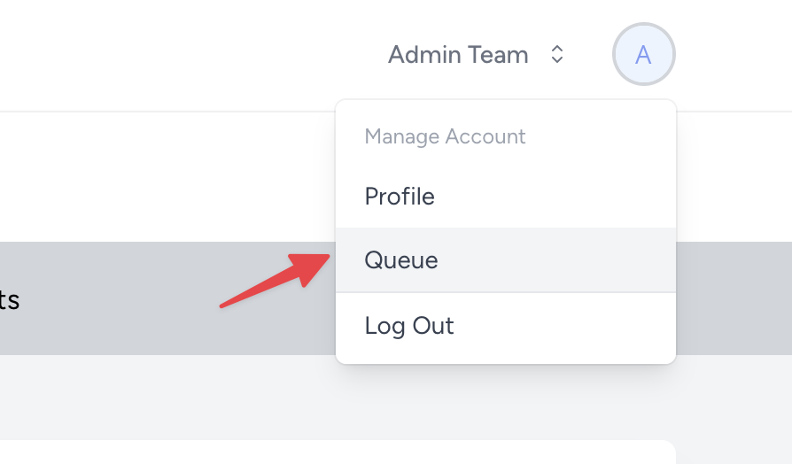
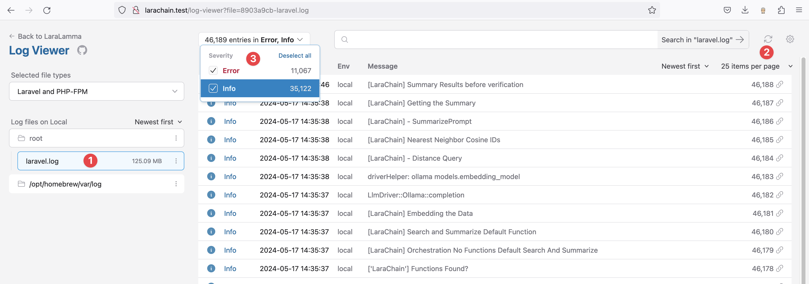

Your First Collection
===================================

Assuming the setup is working you should be able to login in and see a screen like the following:

Sorry the button will most likely say something else but you get the gist 🙃

Add Name and Description
----------------

Choose the LLM
----------------

Now give it a name and a description. The description will help in prompting.

And you can choose your LLM.

The Collection Screen
----------------

  1. The url
  2. Just a note of what LLM you have setup for this Collection
  3. The embedding model
  4. This is where you can edit and change the Model (keep in mind the embedding can not change else you have to run it again)
  5. Add a file see ``tests/example-docs``
  6. You can see the documents below and the checkboxes to do Actions.
  7. The optoins menu to Chat or add Outputs etc.

:::info

    Then upload a file, just one small one to start, there are examples ones here:
    ``tests/example-docs``
:::

Start Chatting
----------------

You can click the menu to start the chat. You can scroll down to get to a chatbox.

Once you click the AirPlane you will send the chat to the backend. It will reload the screen when done.

You can then see Sources, Prompt (so you can troubleshoot or see how it worked) and of course the response.

**Sources**

**Prompt History**

Troubleshooting
----------------

When you upload a doc you will see what is happening in two places:

**Horizon**

You can watch in Horizon the batches running and more.

**Logs**

You can also just checkout the logs UI. The url is ``http://larachain.test/log-viewer``

  1. Choose the logs
  2. Set it to reload
  3. Choose all or a type
