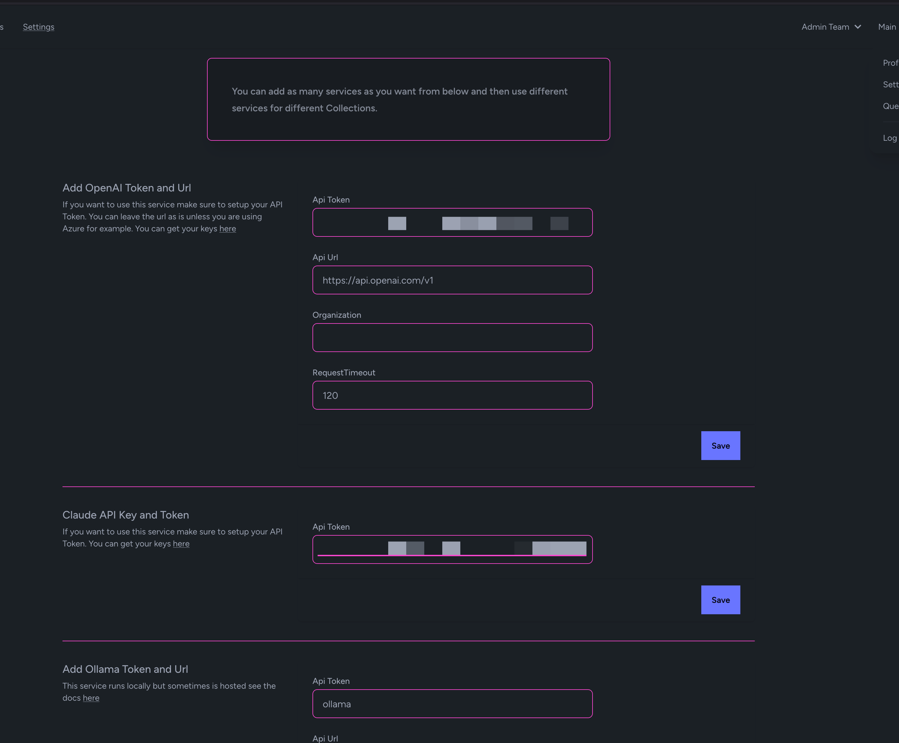
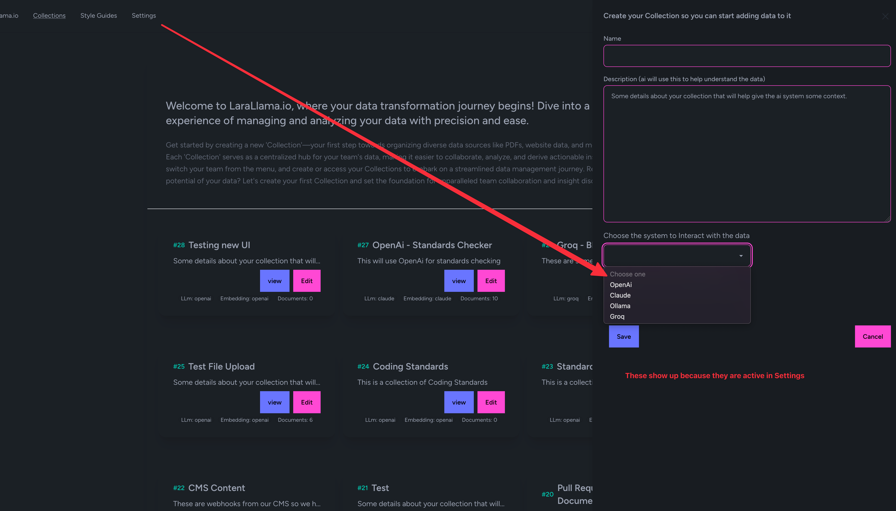

# Local Setup


There are a few parts to this puzzle but not that bad for setting up locally.
It is honestly just a standard Laravel app that uses PostGres since it has a
vector extension.


::: tip
Sometimes the best way to learn how to setup a system is to look at the CI files since they are setting up a system every build. You can see that here ``.github/workflows/ci-cd.yml``
:::


There is a video https://www.youtube.com/watch?v=aTuw6W_8CPE&t=3s for those who like to learn that way.

## Laravel PHP Setup


I use Herd https://herd.laravel.com/ and that does most of the work.
If you follow their docs you will be setup in minutes.

## PostGres

I use the one here https://postgresapp.com/ even though I have Herd Pro.
I could not get the extension to install but maybe now it would work.

I know DBEngin is great too https://dbngin.com/ but the extension did not install at the time.

### Installation Steps

The database will not setup itself like MySQL so you have to do two steps here.
Using TablePlus I open the database and then make the schema ``larachain``

Then I open that database and run this:

```sql
CREATE EXTENSION vector;
```

To clone the repository, run the following command in your terminal:

```bash
git clone https://github.com/LlmLaraHub/laralamma.git
```

Then

```bash
cp .env.example .env
```

And run the normal install steps:

```bash
composer install
npm install
```

Then seed the user:

```bash
php artisan migrate:fresh --seed
```


::: tip
   You can see on the bottom of the .env the username and password for seeding admin user.
:::

Finally you have to run these long running processes one in each terminal:

```bash
php artisan horizon:watch
```

```bash
php artisan reverb:start --debug
```

```bash
npm run dev
```


Ollama, OpenAi, Claude 🤔
----------------

You have a lot of choices here. If you look in the path ``config/llmdriver.php``

You will see you can set ``.env`` settings for different API_TOKENs and models.

Lets talk about Ollama first.

If you install Ollama https://ollama.com/ it is a big win because all your embeddings are free!

So just follow their instructions to get it running. You can then pull:

```bash 
ollama pull llama3
```

To get started with the defaults LLM and:

```bash
ollama pull mxbai-embed-large
```

::: danger
Ok not really Danger but this is required you need a model for embedding
:::

For embedding data.

Now run this at the command line:

```bash
launchctl setenv OLLAMA_NUM_PARALLEL 3
```

To get the most out of ollama for now. Then restart it.

You can test it is working by running these commands:

```bash
curl http://127.0.0.1:11434/api/tags
curl http://localhost:11434/api/tags
```

PHP Settings
----------------

If you have issues with PHP try the following.

```script
max_execution_time=0
upload_max_filesize=500M
memory_limit=-1
post_max_size = 100M
```


Pulling down the latest code!
----------------
Just to make sure it all works do these commands:

```bash
git fetch
git pull origin main
composer install
npm install
php artisan pennant:purge
php artisan optimize:clear
php artisan migrate
```


## Settings

You now have to setup your API keys on the settings page.
Only after you do this will options show up on the "Add Collections" area

#### Settings Page


#### Menu in Collection Add/Edit



## Pusher or Reverb

By default Reverrb will work. Just double check your settings and that you are running the Reverb Listener. But Pusher is an option as well and for now and it has been more solid for me.
All you need to do is setup your .env file to have the needed Puhser info.

```env
BROADCAST_CONNECTION=pusher //this is key
VITE_BROADCAST_CONNECTION="pusher" //just easier to hard code 

PUSHER_APP_ID="123456"
PUSHER_APP_KEY="123456"
PUSHER_APP_SECRET="123456"
PUSHER_HOST=
PUSHER_PORT=443
PUSHER_SCHEME="https"
PUSHER_APP_CLUSTER="us2"

VITE_APP_NAME="${APP_NAME}"
VITE_PUSHER_APP_KEY="${PUSHER_APP_KEY}"
VITE_PUSHER_HOST="${PUSHER_HOST}"
VITE_PUSHER_PORT="${PUSHER_PORT}"
VITE_PUSHER_SCHEME="${PUSHER_SCHEME}"
VITE_PUSHER_APP_CLUSTER="${PUSHER_APP_CLUSTER}"
```


Then if you have run Reverb make sure to 

```bash
php artisan optimize:clear
```

And of course `npm run dev` restart that or build rebuild.