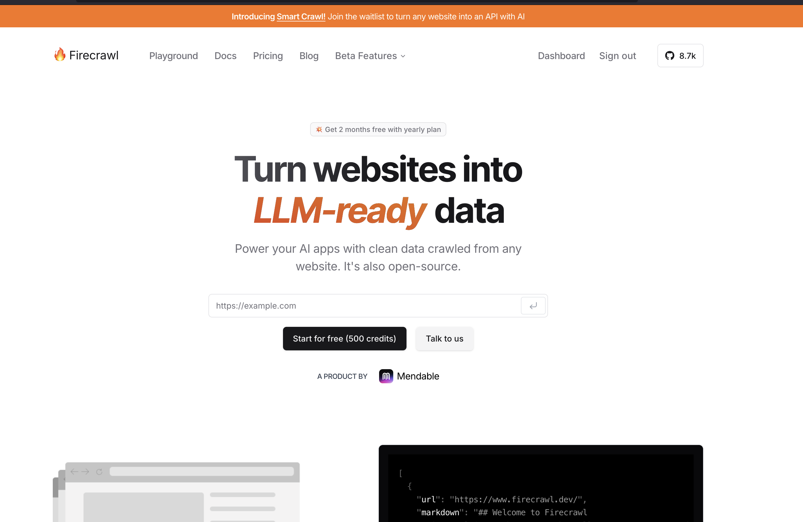
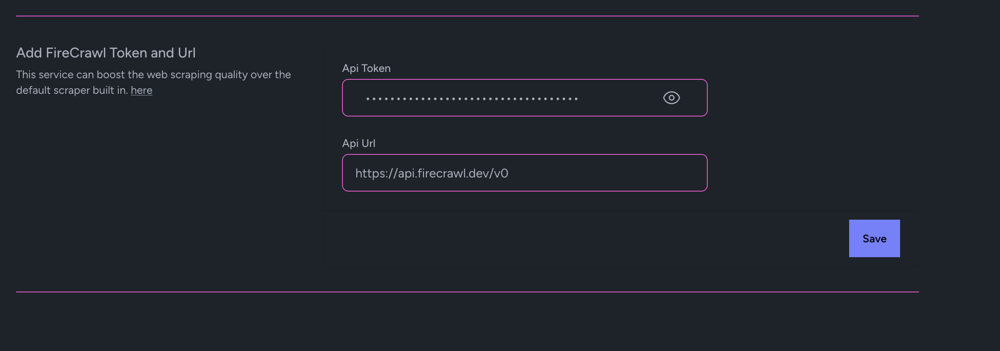

Plugins
=====

Here we will start to centralize how to setup external services to integrate with LaraLlama.io

FireCrawl
----------------

    

The built in scraping uses Browsershot and works fine. But if you want more of the features and maybe the better parsing FireCrawl offers give it a shot by getting your API Token
and going to Settings to add it.

    