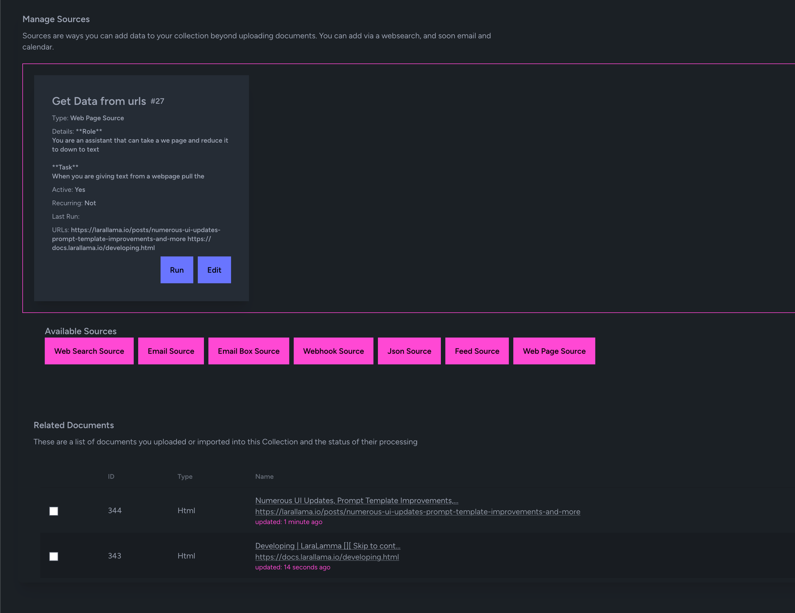
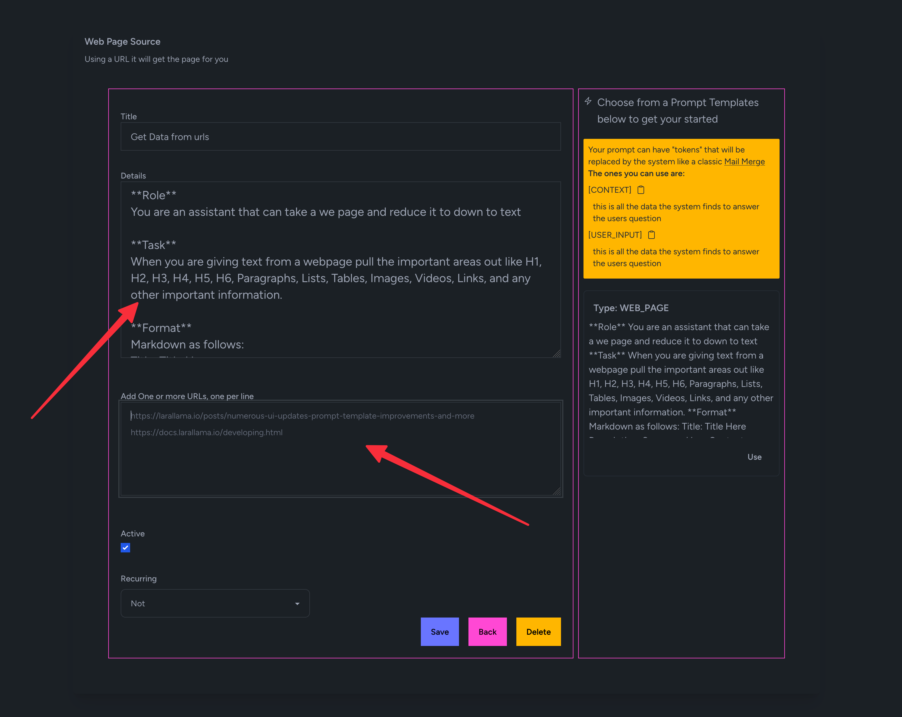
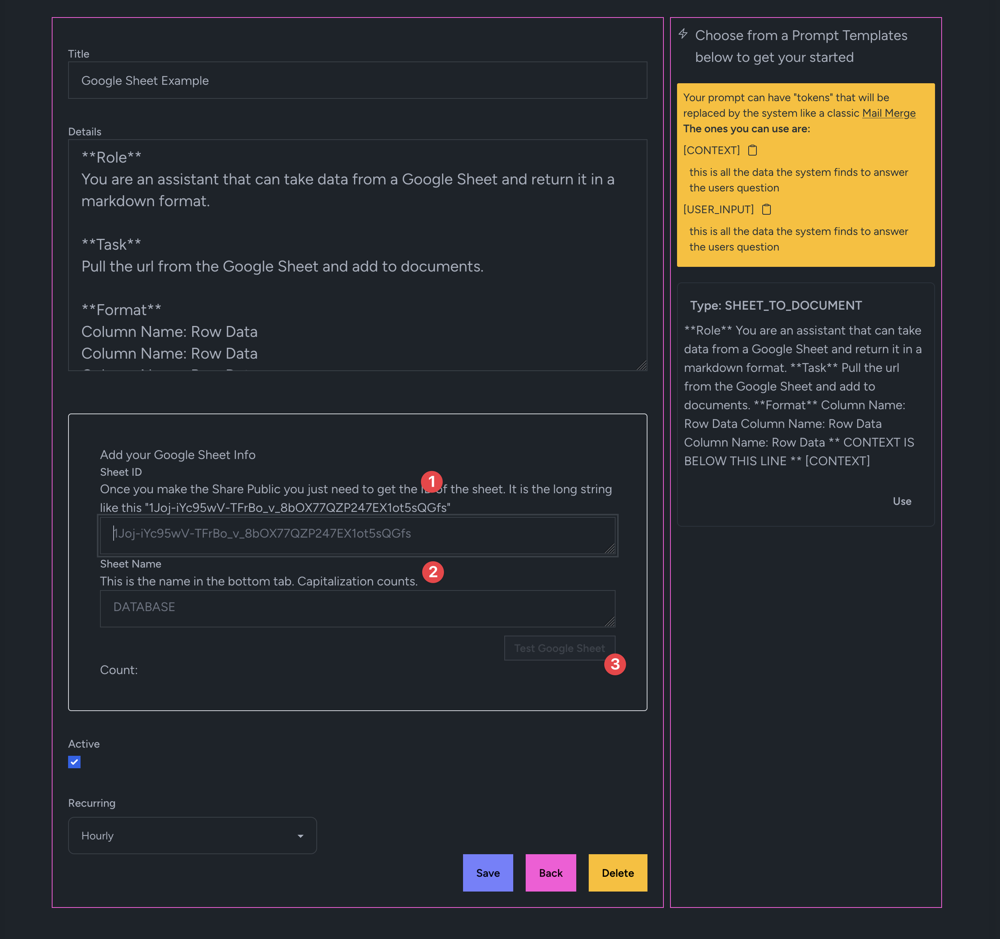
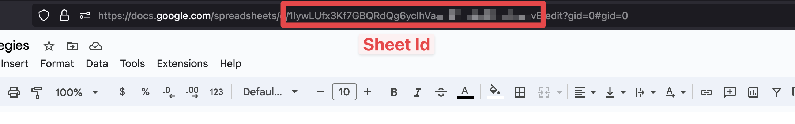
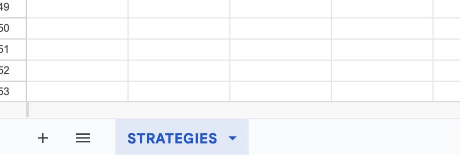
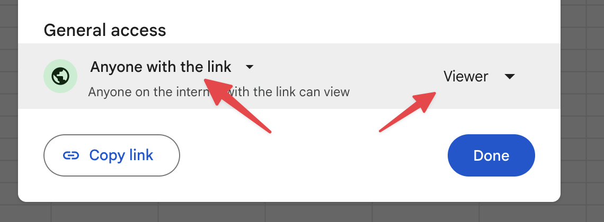

# Sources

This is how you can get data into your collections

Source can run on a schedule as well. For example Search the web daily for "News about Laravel" and create a news feed Collection.

## Email Source

Have the system look at a provided email box that you can forward emails to

See the vide [here](https://youtu.be/IN3-7tUM6o8)

## Web Pages

You can add a list of URLs to pull them into the system.

## Web Search Source

Search for a phrase and pull in the data!

See the vide [here](https://youtu.be/KM7AyRHx0jQ)

## Email Box Source

Even better point it to your own Email box and label/folder to get those emails.

See the vide [here](https://youtu.be/IN3-7tUM6o8)

## Webhook Source

Send data into the system from GitHub!

See the vide [here](https://youtu.be/KM7AyRHx0jQ)

## Json Source

This is more for getting quick data into the system via copy pasta

## Feed Source

Point it to a feed and get your content into the your Collection!

See the vide [here](https://youtu.be/0VBqYnLcZ3g)

## Google Sheet

Click on the Google Sheet Source

Then add the id of the sheet, you can see this in the url of the Google Sheet

Then grab the name of the sheet 

Finally make the sheet viewable (sorry right now auth is not supported coming in August 2024)

Then click Test and see the data coming in.

Lastly save and run!