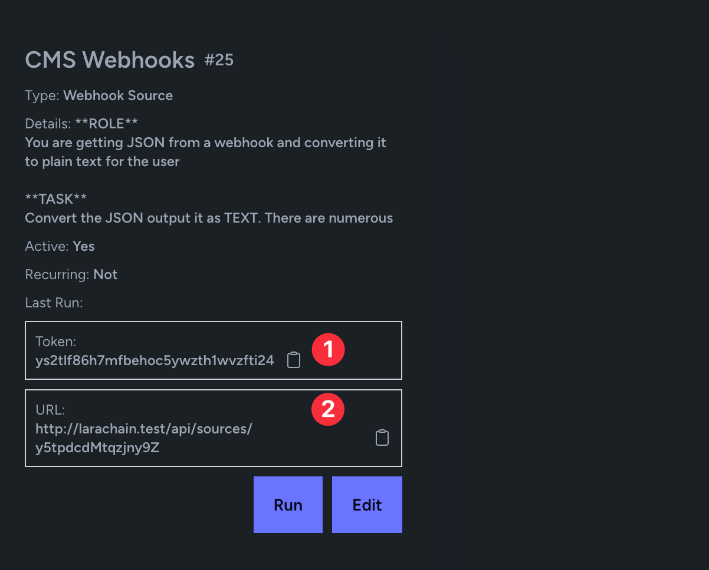

Use Cases
=====

Below are numerous uses cases that I continue to make videos about. You can join our YouTube channel [https://www.youtube.com/playlist?list=PLL8JVuiFkO9I1pGpOfrl-A8-09xut-fDq](https://www.youtube.com/playlist?list=PLL8JVuiFkO9I1pGpOfrl-A8-09xut-fDq)

The bottom line is a CRS (Content Retreival System) becomes a hub of automation and a way to make the most of your companies data.


External Chat Widget
----------------

    

You can see the widget here https://github.com/LlmLaraHub/laralamma/tree/main/stubs/chat_widget

Just add the script and the css to your app (the index.html is just for example)

Then update the token in it or an environment variable and the url to match the server and token for that collection.

That is it chat away with your collection!

Watch more of it here https://www.youtube.com/watch?v=5WYUnC7OFaE

Chat Widget from https://www.patreon.com/posts/simple-and-easy-104606949

Chat Support Widget
-------------

Same as above but the focus in this video shows how the Chat widget can help with customer support!


Rag System
-------------

:::info
RAG system (Retrieval augmented generation system (RAG - an architectural approach that can improve the efficacy of large language model (LLM) applications
:::

    
This means you can upload PDF files, PowerPoints, pull in web data and chat with it as collections with you and your team.

You ca see a video here of it working https://www.youtube.com/watch?v=SUwI70h5kVY


Email Checking
-------------
Get emails (Support, Marketing) and then chat with those or better yet
get a daily summary of the emails sent to you! [here](https://www.youtube.com/watch?v=IN3-7tUM6o8)

[](https://www.youtube.com/watch?v=IN3-7tUM6o8)

You can see this video here on how to setup a Email Box Source, and setup an output of a Daily Report.


Email Reply
-------------
Get emails (Support, Marketing) and then uses your collection
as an example of replies or "Your Company Voice"
And then send a reply to the person


Web Hooks and Automation
-------------


Take webhooks from Github or other systems and review the updates
then reply back to the system with comments like.

"You missed the best practice xzy when it comes to this update"

You can read the article here https://medium.com/@alnutile/laravel-rag-3-steps-to-import-commits-summarize-create-a-release-log-8f1d349b6a06

And the video here https://www.youtube.com/watch?v=KM7AyRHx0jQ&t=1s


On Board New Staff
-------------
Upload your onboarding docs and then add the system to Slack or Teams to help
someone chat with the info they need!

Statamic to LaraLlama on Content Update
-----------
This will work with any CMS really.

In Statamic we just need to add a listener `app/Listeners/SendWebhookListener.php`

and then in there do a simple bit of code:

```php 

<?php

namespace App\Listeners;

use Facades\App\Domains\WebhookClient\Client;
use Illuminate\Contracts\Queue\ShouldQueue;
use Illuminate\Queue\InteractsWithQueue;
use Illuminate\Support\Facades\Log;
use Statamic\Events\CollectionSaved;
use Statamic\Events\EntrySaved;

class SendWebhookListener
{
    /**
     * Create the event listener.
     */
    public function __construct()
    {
        //
    }

    /**
     * Handle the event.
     */
    public function handle(EntrySaved $event): void
    {
        Log::info("Sending webhook");
        Client::handle($event->entry->toArray());
        Log::info("Done Sending webhook");
    }
}
```

Ok now lets add a Client we can use in numerous places. `app/Domains/WebhookClient/Client.php`

```php
<?php

namespace App\Domains\WebhookClient;

use Illuminate\Support\Facades\Http;
use Illuminate\Support\Facades\Log;

class Client
{

    public  function handle(array $data) : bool|\Exception {
        $token = env('WEBHOOK_TOKEN');
        if (is_null($token)) {
            throw new \Exception('Invalid token');
        }

        $url = env("WEBHOOK_URL");

        if (empty($url)) {
            throw new \Exception('No webhook url');
        }

        $response  = Http::withToken($token)
            ->withHeaders([
                'Content-Type' => 'application/json',
                'Accept' => 'application/json',
            ])
            ->post($url, [
            'id' => data_get($data, 'id'),
            'content' => $data,
        ]);

        if ($response->failed()) {
            Log::error("Failed to post to webhook",
                [
                    'status' => $response->status()
                ]
            );
            throw new \Exception($response->json());
        }

        Log::info("Posted to Webhook", $response->json());

        return true;
    }
}

```

Ok now we can get the `WEBHOOK_TOKEN` and `WEBHOOK_URL` when we add the Source to LaraLlama.

Let's do that now.

Add a new Collection [here](/first-collection.html)

Then for the Source we will add WebSearch source [see here](first-collection.html#adding-a-source)

In our case we will add the "Webhook Source"


Then it will look like this


Notice too the prompt it just explains what you want from the JSON coming in. Maybe you do not know what the JSON is that is ok. We can talk more about other ways to get the data. 

Ok once you save it it will give you the `WEBHOOK_URL` and `WEBHOOK_TOKEN`



  * 1 is the Token
  * 2 is the URL

  Then you are set when you add a Page to the Statmic site or update it it will send a webhook over to your LaraLlama install.

  Then in LaraLlama you can see the Document and the vectorized summarized data.

  


The big win here is you can send content from numerous sites here to do end of the month summary of articles as well as search and a sense of "voice" to marketing emials etc.


Coming Soon 
-------------

  * Workflows so you can notify "new staff" daily with next steps in the onboarding.
  * CRM features so you can turn emails into contacts
  * See more https://github.com/orgs/LlmLaraHub/projects/1